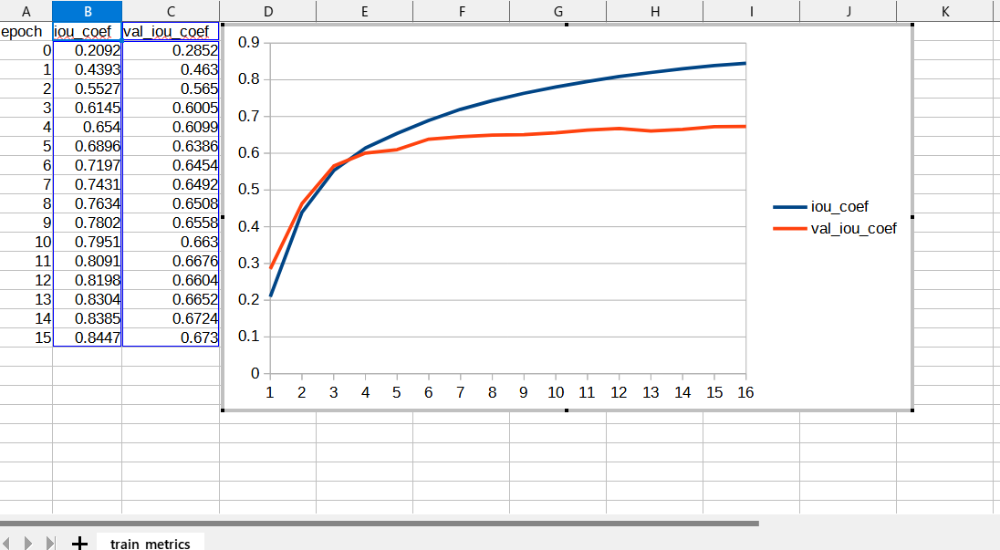

<h2>
Image-Segmentation-ImageMaskDataGenerator (Fixed: 2023/08/25)
</h2>
This is an experimental project to detect <b>Retinal-Vessel</b> by using 
<a href="./ImageMaskDatasetGenerator.py"> ImageMaskDatasetGenerator</a> and 
<a href="./ImageMaskAugmentor.py">ImageMaskAugmentor</a> on 
a classical UNet Model <a href="https://github.com/atlan-antillia/Tensorflow-Slightly-Flexible-UNet">
Tensorflow-Slightly-Flexible-UNet.</a> 

 
 The original segmentation dataset for Retinal-Vessel has been take from the following web site 
Retinal Image Analysis 
</b>
<pre>
https://blogs.kingston.ac.uk/retinal/chasedb1/
</pre>
<li>2023/08/25: Fixed some section name setting bugs in ImageMaskAugmentor.py </li>
<h2>
1. Installing tensorflow on Windows11
</h2>
We use Python 3.8.10 to run tensoflow 2.10.1 on Windows11. 
<h3>1.1 Install Microsoft Visual Studio Community</h3>
Please install <a href="https://visualstudio.microsoft.com/ja/vs/community/">Microsoft Visual Studio Community</a>, 
which can be used to compile source code of 
<a href="https://github.com/cocodataset/cocoapi">cocoapi</a> for PythonAPI. 
<h3>1.2 Create a python virtualenv </h3>
Please run the following command to create a python virtualenv of name <b>py38-unet</b>.
<pre>
>cd c:\
>python38\python.exe -m venv py38-unet
>cd c:\py38-unet
>./scripts/activate
</pre>
<h3>1.3 Create a working folder </h3>
Please create a working folder "c:\google" for your repository, and install the python packages. 

<pre>
>mkdir c:\google
>cd    c:\google
>pip install cython
>git clone https://github.com/cocodataset/cocoapi
>cd cocoapi/PythonAPI
</pre>
You have to modify extra_compiler_args in setup.py in the following way:
<pre>
   extra_compile_args=[]
</pre>
<pre>
>python setup.py build_ext install
</pre>

 
<h2>
2. Installing Image-Segmentation-ImageMaskDataGenerator
</h2>
<h3>2.1 Clone repository</h3>
Please clone Image-Segmentation-ImageMaskDataGenerator.git in the working folder <b>c:\google</b>. 
<pre>
>git clone https://github.com/sarah-antillia/Image-Segmentation-ImageMaskDataGenerator 
</pre>
You can see the following folder structure in Image-Segmentation-ImageMaskDataGenerator of the working folder. 

<pre>
./Image-Segmentation-ImageMaskDataGenerator
├─asset
└─projects
    └─Retinal-Vessel
        ├─eval
        ├─generator
        │  └─CHASEDB1
        ├─models
        ├─Retinal-Vessel
        │  ├─test
        │  │  ├─images
        │  │  └─masks
        │  ├─train
        │  │  ├─images
        │  │  └─masks
        │  └─valid
        │      ├─images
        │      └─masks
        ├─test_output
        └─test_output_merged

</pre>
<h3>2.2 Install python packages</h3>

Please run the following command to install python packages for this project. 
<pre>
>cd ./Image-Segmentation-ImageMaskDataGenerator
>pip install -r requirements.txt
</pre>

 
<h2>3 Prepare Retinal-Vessel dataset</h2>
<h3>
3.1. Download 
</h3>
Please download original <b>CHASEDB1</b> dataset from the following link.
 
<b>
Retinal Image Analysis 
</b>
<pre>
https://blogs.kingston.ac.uk/retinal/chasedb1/
</pre>
The folder structure of the dataset is the following. 
<pre>
./CHASEDB1
  +-- Image_01L.jpg
  +-- Image_01L_1stHO.png
  +-- Image_01L_2bdHO.png
  +-- Image_01R.jpg
  +-- Image_01R_1stHO.png
  +-- Image_01R_2bdHO.png
  ...
  +-- Image_14L.jpg
  +-- Image_14L_1stHO.png
  +-- Image_14L_2bdHO.png
  +-- Image_14R.jpg
  +-- Image_14R_1stHO.png
  +-- Image_14R_2bdHO.png
</pre>
The <b>CHASEDB1</b> folder of this dataset contains the ordinary image files (Image_*.jpg) and 
two types of mask png files(*_1stHO.png and *_2ndHO.png) corresponding to each image jpg file.
Please note that it contains only 28 jpg Image files of 999x960 pixel size, which is apparently too few to use for our UNet model. 
<b>CHASEDB1 samples:</b> 

 
<h3>
3.2. Generate Retinal-Vessel Image Dataset
</h3>
 We have created Python script <a href="./projects/Retinal-Vessel/generator/512x512ImageMaskDatasetSplitter.py">
 512x512ImageMaskDatasetSplitter.py</a> to split original images and masks dataset to test, train and valid
 dataset.
 This script will perform following image processing. 
 <pre>
 1 Resize all jpg and png files in <b>CHASEDB1</b> folder to 512x512 square images.
 2 Split image and mask files in <b>CHASEDB1</b> folder into test, train and valid dataset.
</pre>
For simplicity, please note that we have used the <b>2ndHO.png </b> type mask files. 

<h3>
3.3 Generated Retinal-Vessel dataset. 
</h3>
Finally, we have generated the resized (512x512) jpg files dataset below.  
<pre>
Retinal-Vessel
├─test
│  ├─images
│  └─masks
├─train
│  ├─images
│  └─masks
└─valid
    ├─images
    └─masks
</pre>

<b>train/images: samples</b> 
 
<b>train/masks: samples</b> 
 
As shown above, Retinal-Vessel/train/images folder contains only 18 images, which is apparently too few to use for the training of the
TensorflowUNet model. 
To deal with this very small datasets problem, we have used the following classes to augment images and masks in the training process of
 <b>train</b> method in <a href="./TensorflowUNet.py">TensorflowUNet</a> classs. 
<li>
<a href="./ImageMaskDatasetGenerator.py">ImageMaskDatasetGenerator</a> 
</li>
<li>
<a href="./ImageMaskAugmentor.py">ImageMaskAugmentor</a>
</li>
Please note that <b>generate</b> method in ImageMaskDatasetGenerator class yields a pair of images and masks, (X, Y), 
where X is a set of augmented images 
and Y a set of augmented masks corresponding to X.
 
<h2>
4 Train TensorflowUNet Model by ImageMaskDatasetGenerator
</h2>
 We have trained Retinal-Vessel TensorflowUNet Model by using 
 <b>train_eval_infer.config</b> file and <a href="./TensorflowUNetGeneratorTrainer.py">TensorflowUNetGeneratorTrainer.py</a>.  
Please move to <b>./projects/Retina-Vessel</b> directory, and run the following bat file. 
<pre>
>1.train_by_generator.bat
</pre>
, which simply runs the following command. 
<pre>
>python ../../TensorflowUNetGeneratorTrainer.py ./train_eval_infer.config
</pre>
, where train_eval_infer.config is the following.
<pre>
; train_eval_infer.config
; Retinal-Vessel, GENERATOR-MODE
; 2023/08/25 antillia.com

[model]
generator     = True
image_width    = 512
image_height   = 512
;image_width    = 384
;image_height   = 384

image_channels = 3
num_classes    = 1
base_filters   = 16
base_kernels   = (7,7)
num_layers     = 7
dropout_rate   = 0.08
learning_rate  = 0.0001
clipvalue      = 0.2
dilation       = (2,2)
;loss           = "binary_crossentropy"
loss           = "bce_iou_loss"
metrics        = ["iou_coef"]
;metrics        = ["binary_accuracy", "sensitivity", "specificity"]
show_summary   = False

[train]
epochs        = 100
batch_size    = 4
steps_per_epoch = 400
validation_steps = 800
patience      = 10
metrics       = ["iou_coef", "val_iou_coef"]
model_dir     = "./models"
eval_dir      = "./eval"
image_datapath = "./Retinal-Vessel/train/images/"
mask_datapath  = "./Retinal-Vessel/train/masks/"
create_backup  = False

[eval]
; valid dataset will be used in training on generator=True.
image_datapath = "./Retinal-Vessel/valid/images/"
mask_datapath  = "./Retinal-Vessel/valid/masks/"

[test]
; Use test dataset for evaluation on generator=True.
; because valid dataset is already used in training process 
image_datapath = "./Retinal-Vessel/test/images/"
mask_datapath  = "./Retinal-Vessel/test/masks/"

[infer] 
images_dir    = "./Retinal-Vessel/test/images/"
output_dir    = "./test_output"
merged_dir    = "./test_output_merged"

[mask]
blur      = True
binarize  = True
threshold = 60

[generator]
debug     = True
augmentation   = True

[augmentor]
vflip    = True
hflip    = True
rotation = True
;2023/08/24
angles   = [90, 180, 270]
</pre>

You can also specify other loss and metrics functions in the config file. 
Example: basnet_hybrid_loss(https://arxiv.org/pdf/2101.04704.pdf) 
<pre>
loss         = "basnet_hybrid_loss"
metrics      = ["dice_coef", "sensitivity", "specificity"]
</pre>
On detail of these functions, please refer to <a href="./losses.py">losses.py</a> , and 
<a href="https://github.com/shruti-jadon/Semantic-Segmentation-Loss-Functions/tree/master">Semantic-Segmentation-Loss-Functions (SemSegLoss)</a>.
 
 
<b>Train console output</b> 
 
 
<b>Train metrics line graph</b>: 
 

 
<b>Train losses line graph</b>: 
 

<h2>
4 Evaluation
</h2>
 We have evaluated prediction accuracy of our Pretrained Retinal-Vessel Model by using <b>test</b> dataset.
Please run the following bat file. 
<pre>
>2.evalute.bat
</pre>
, which simply run the following command. 
<pre>
>python ../../TensorflowUNetEvaluator.py ./train_eval_infer.config
</pre>
The evaluation result of this time is the following. 
 
 

<h2>
6 Inference 
</h2>
We have also tried to infer the segmented region for <a href="./projects/Retinal-Vessel/Retinal-Vessel/test/images"><b>
Retinal-Vessel/test/images</b> </a>
dataset, which is a very small dataset including only seven images.<pre>
>3.infer.bat
</pre>
, which simply runs the following command. 
<pre>
>python ../../TensorflowUNetInferencer.py ./train_eval_infer.config
</pre>

<b>Input images (Retinal-Vessel/test/images) </b> 
 
 
<b>Ground truth masks (Retinal-Vessel/test/masks) </b> 
 
 
<b>Inferred masks (test_output)</b> 
  

<h3>
References
</h3>
<b>1. State-of-the-art retinal vessel segmentation with minimalistic models</b> 
Adrian Galdran, André Anjos, José Dolz, Hadi Chakor, Hervé Lombaert & Ismail Ben Ayed  
<pre>
https://www.nature.com/articles/s41598-022-09675-y
</pre>

<b>2. Image-Segmentation-Retinal-Vessel</b> 
Toshiyuki Arai @antillia.com 
<pre>
https://github.com/sarah-antillia/Image-Segmentation-Retinal-Vessel
</pre>
